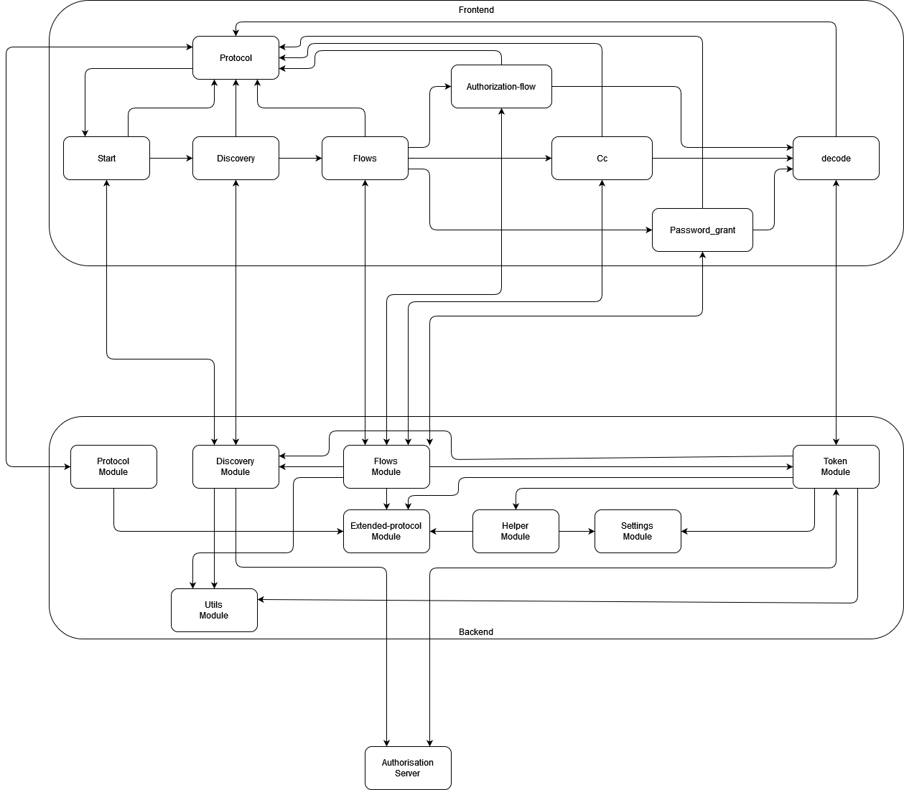

# Architecture
This document describes the current architecture of the project and explains some of the design decisions, that were made during the execution of this project.

## Tech-Stack
* Node.js
* Twitter-Bootstrap

## Current Architecture
  
The application consists of multiple modules, that provide the logic for a certain part of the application. Each module is stored in a separate folder in the {{/src}}-directory and consists of the following components:
* a service-class containing the application-logic (naming-convention: xxx.service.ts)
* a spec-class containing the unit-tests for the application-logic (naming-convention: xxx.service.spec.ts)
* a controller-class handling the user-input and the what output is displayed to the user (naming-convention: xxx.controller.ts)
* a module-class describing the components and dependencies of the module (naming-convention: xxx.module.ts)
* optionally one or more classes for data-transfer-objects that are used to handle user-input or the output returned from the services (naming-convention: xxx.dto.ts)

Each folder is named after the corresponding module. So in case you want to add a new functionality to the application, that is not related to one of the current modules, create a new folder in the {{/src}}-directory and create the aforementioned components. If you are new to this project and need some hints on how to get started, have a look at the official nest.js-documentation or look at the existing components. Currently there are the following modules:  
|Name|Functionality|Remarks|
|----|-------------|-------|
|Discovery|Handles the analysis of the discovery-endpoints||
|Extended-Protocol|Extension of the internal logger, to provided more detailed log-information|Does not have a controller|
|Flows|Handles the input for the different authentication flows and also handles the analysis of the received access-tokens|Combines the logic of the other modules to handle the analysis|
|Helper|Contains helper-functions, that are used in multiple modules across the project|Does not have a controller|
|Protocol|Handles and provides access to the internal protocol||
|Settings|Provides programmatic access to the settings-file.||
|Token|Contains the logic to analyse, decode and validate a provided token.||

The user-interface is handled separately from the application logic and is described via multiple hbs-templates, that are stored in the {{/views}}-directory. These templates are referenced in the controllers and can be reused for multiple modules.

## Architecture Decisions
### Why Nest.js?
We chose Nest.js, because it was a well-documented Node.JS-Framework, that provided the basic functionality that we needed for this project and would also allow us to change the type of application we build without the need to rewrite the existing code-base.