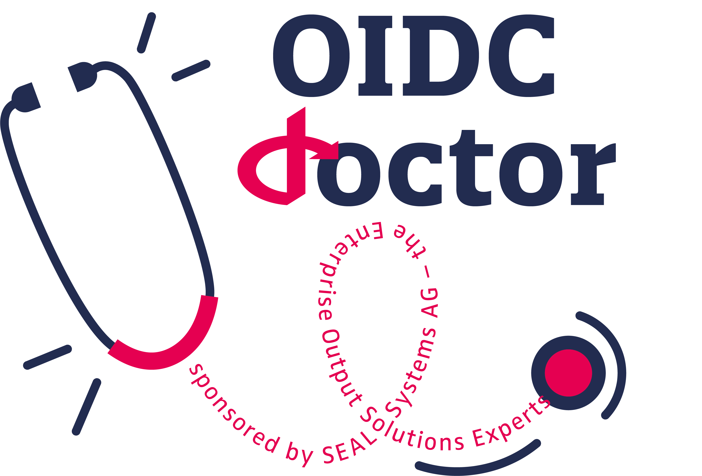

# OpenID Connect Doctor 

<p align="center">

</p>

The OpenID Connect Doctor is a tool for the creation of authentication configurations with OpenID for your applications. That includes also the verification of valid tokens and password grants. You can download the configuration in a JSON format and include it into any application then.

## Documentation
The documentation can be found in the [Documentation-Folder](https://github.com/sealsystems/openid-connect-doctor/blob/main/Documentation/user-documentation.md).
If you find any mistakes or if you have an idea how to improve the documentation, please create an issue or a pull-request.

## Local Development
### Prerequisites
* Git
* Node.js Version 16.15.0 or later (with NPM)
* Optional: A local docker environment (for testing purposes)

### Build


Before you can build the application you have to checkout the code from github.

```sh
# Clone via HTTPS
git clone https://github.com/sealsystems/openid-connect-doctor.git

# Clone via SSH
git clone git@github.com:sealsystems/openid-connect-doctor.git
```

After that you can just run the included build-scripts (```build.ps1``` or ```build.sh```) or execute the following commands in your terminal of choice to build and start the app:
```sh
# Install the npm packages
npm install

# Build the app
npm run build

# Start the app
npm start
```

### Testing
The applications contains unittests that can be used to test the individual components. To run them locally just execute the following command:

```sh
npm test
```

If you want to test your changes against a local OpenId-Connect-Server we recommend that you use [Keycloak](https://github.com/keycloak/keycloak) in a local docker enviroment. If you need information on how to set up keycloak in docker, have a look at the [official documentation](https://www.keycloak.org/getting-started/getting-started-docker).
